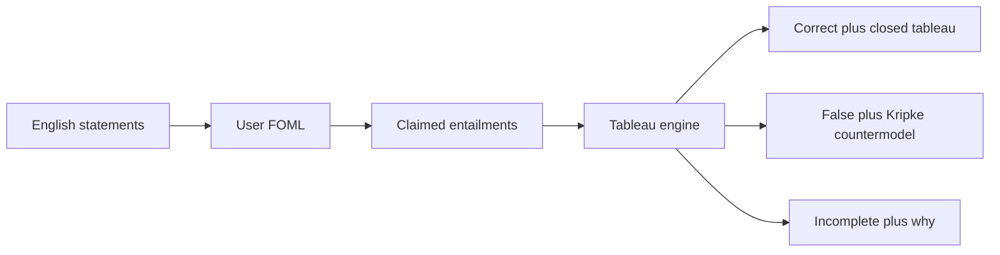

# FOML

Client-side workbench for checking arguments in first-order modal logic. You write English claims, formalize them yourself, declare which claims entail which, and the app judges each deduction.

```bash
pnpm install && pnpm dev
```

## Loop

1. Numbered English statements (e.g. `P1 Socrates is a man`).
2. You formalize each in FOML. The app does not translate English.
3. Inferences (`P1, P2 ⊢ P3`).
4. Modal system (default **S5**; also K, T, D, B, S4) and domain (default **constant**, rigid designators).
5. Verdict: **correct**, **false**, or **incomplete**.



## Verdicts

- **Correct**: premises and conclusion parse; `premises ⊢ conclusion` tableau closes. Unused extra premises stay correct, with a warning.
- **False**: saturated open branch yields a finite Kripke countermodel (worlds, accessibility, domain, atomic diagram). The conclusion does not follow — often a missing premise or de re / de dicto mismatch.
- **Incomplete**: cannot judge. Missing formula, parse error, unknown id, or search bound. FOML is undecidable; a bound is incomplete, never false.

## Stack

Vite, React, TypeScript, in-browser tableau. pnpm only. Versions and extra tooling (eslint, vitest) live in `package.json`. No UI kit, backend, or LLM.

```
README.md, AGENTS.md, SKILLS.md, PLAN.md, package.json, pnpm-lock.yaml, vite.config.ts, tsconfig.json, eslint.config.js, index.html
architecture/
src/main.tsx, src/App.tsx, src/styles.css
src/engine/{ast,parse,pretty,tableau,frames,countermodel,check}.ts
src/ui/{StatementList,FormulaField,InferenceList,VerdictPane,KripkeView,TableauView,LogicBar,Cheatsheet,Examples}.tsx
src/examples/*.ts
src/engine/*.test.ts
```

## Docs

| File | Owns |
| --- | --- |
| This README | Product, run, stack, out of scope |
| [PLAN.md](PLAN.md) | Build order |
| [architecture/syntax.md](architecture/syntax.md) | Language and concrete syntax |
| [architecture/engine.md](architecture/engine.md) | Tableau, frames, `checkInference`, tests |
| [architecture/UI.md](architecture/UI.md) | Workbench, persistence, examples |
| [AGENTS.md](AGENTS.md) | Agent workflow |
| [SKILLS.md](SKILLS.md) | How to extend the system |

## Out of scope (v1)

- Auto-translating English into FOML
- Function symbols, higher-order logic, a complete FOML decision procedure
- Natural-deduction proofs (the tableau is the proof object)
- Server, accounts, cloud sync, LLM-assisted formalization
