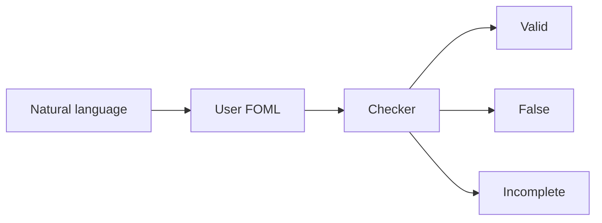

# FOML

Client-side workbench for checking arguments in first-order modal logic. You write claims in natural language, formalize them yourself, and the inspector judges each proposition.

```bash
pnpm install && pnpm dev
```

## Loop

1. Numbered statements in natural language (e.g. `P1 Socrates is a man`).
2. You formalize each in FOML. The app does not translate natural language.
3. Assumed logic: system **D**, **constant** domain, rigid designators.
4. Inspector: **valid**, **false**, or **incomplete** (blank if no formula). Notes are a tooltip. False names the contradicted statement. Incomplete rows can be marked as **postulates** (assumed, not judged).



## Verdicts

- **Valid**: follows from the other propositions (later: tableau closes).
- **False**: the other propositions rule it out (later: countermodel). The inspector names the contradicted statement.
- **Incomplete**: does not follow from the others, and is not ruled out (later: also search bound). Empty formula: inspector blank, not incomplete. Mark as a **postulate** to assume it; inspector greys out; it remains a premise for other rows.

## Stack

Vite, React, TypeScript, in-browser tableau. pnpm only. Versions and extra tooling (eslint, vitest) live in `package.json`. No UI kit, backend, or LLM.

```
README.md, AGENTS.md, SKILLS.md, PLAN.md, package.json, pnpm-lock.yaml, vite.config.ts, tsconfig.json, eslint.config.js, index.html
architecture/
src/main.tsx, src/App.tsx, src/styles.css
src/engine/{ast,parse,pretty,tableau,frames,countermodel,check,inspect}.ts
src/ui/{StatementList,FormulaField,LogicBar,HowItWorks,InspectorCell,Cheatsheet,Examples,KripkeView,TableauView}.tsx
src/examples/*.ts
src/engine/*.test.ts
```

## Docs

| File | Owns |
| --- | --- |
| This README | Product, run, stack, out of scope |
| [PLAN.md](PLAN.md) | Build order |
| [architecture/syntax.md](architecture/syntax.md) | Parser contract. Tables: `src/engine/syntaxGuide.ts` |
| [architecture/engine.md](architecture/engine.md) | Tableau, frames, `checkInference`, tests |
| [architecture/UI.md](architecture/UI.md) | Workbench, persistence, examples |
| [AGENTS.md](AGENTS.md) | Agent workflow |
| [SKILLS.md](SKILLS.md) | How to extend the system |

## Out of scope (v1)

- Auto-translating natural language into FOML
- Function symbols, higher-order logic, a complete FOML decision procedure
- Natural-deduction proofs (the tableau is the proof object)
- Server, accounts, cloud sync, LLM-assisted formalization
